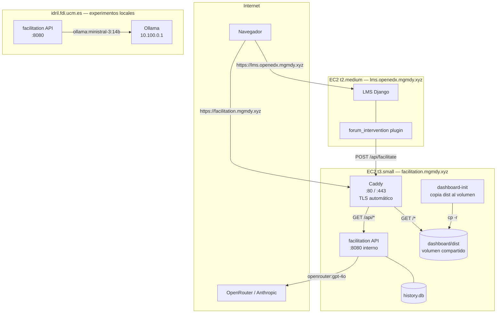

# DDA-0042: Despliegue del servicio de facilitación en AWS EC2 con Docker Compose, Caddy y ECR

**Estado**: Aceptado
**Fecha**: 2026-06-14
**Depende de**: ADR-0039 (despliegue en Idril), ADR-0040 (Open edX en EC2), ADR-0035 (configuración en tiempo de despliegue)

## Contexto

El servicio de facilitación estaba desplegado únicamente en `idril.fdi.ucm.es`. Ese servidor tiene restricciones de seguridad que bloquean las llamadas salientes a servicios externos: el proceso FastAPI no puede alcanzar proveedores de LLM en internet (OpenRouter, Anthropic, OpenAI), ni tampoco la instancia de Open edX en EC2.

Esto limita los experimentos de dos formas. Primera, solo se pueden usar los modelos locales disponibles en la red interna de Idril (Ollama en `10.100.0.1`). Segunda, el ciclo live de facilitación, donde Open edX activa el servicio y este responde con una intervención, no puede cerrarse porque Idril no puede alcanzar Open edX.

La solución es desplegar el servicio en una instancia EC2 propia, sin restricciones de red, que pueda comunicarse con Open edX y con proveedores de LLM externos. Idril se mantiene para experimentos con modelos locales.

### Arquitectura resultante

Fuente: [`docs/diagrams/hosting-ec2.mmd`](../diagrams/hosting-ec2.mmd) — exportar con `make diagrams-export`.

Los dos despliegues del servicio de facilitación son el mismo código con distinto `.env.local`. El proveedor de LLM se selecciona por el prefijo del modelo (`ollama:*` en Idril, `openrouter:*` o `anthropic:*` en EC2) sin ningún cambio de código.

### Por qué no un único despliegue

Idril tiene los modelos locales (Ollama), que son el objeto de estudio comparativo de la evaluación. Sin Idril, los experimentos con modelos locales requieren montar Ollama en EC2 (coste, gestión de GPU, latencia). Mantener Idril para experimentos y EC2 para el ciclo live es más barato y preserva el setup de evaluación existente.

### Por qué Docker Compose y no scripts ad-hoc

En Idril los scripts de despliegue (git pull + uv sync + npm build + systemd) son necesarios porque el servidor universitario no dispone de Docker. En EC2 se tiene control total, por lo que se puede usar la solución estándar. El `Containerfile` multi-stage ya existía para pruebas locales con `podman`; reutilizarlo para producción evita mantener un entorno Python y Node en el servidor.

### Por qué Caddy y no FastAPI sirviendo archivos estáticos

La primera iteración sirvió el dashboard directamente desde FastAPI con `StaticFiles` y un catch-all SPA. Aunque funciona, mezcla responsabilidades: FastAPI pasa a gestionar tanto rutas de API como archivos estáticos, y el orden de registro de rutas se vuelve frágil.

La solución adoptada separa las responsabilidades: Caddy sirve los archivos estáticos del dashboard (copiados a un volumen compartido por un contenedor init) y proxea `/api/*` a FastAPI. FastAPI queda como API pura. El `Caddyfile` es una sola directiva de cinco líneas; el TLS con Let's Encrypt lo gestiona Caddy sin configuración adicional.

## Decisión

Desplegamos el servicio en una instancia EC2 t3.small (Ubuntu 22.04) con tres contenedores Docker Compose:

- `dashboard-init`: copia `dashboard/dist` de la imagen al volumen compartido y termina.
- `facilitation`: la API FastAPI en el puerto 8080 interno. Solo API, sin archivos estáticos.
- `caddy`: proxy inverso con TLS automático. Sirve el dashboard desde el volumen para `GET /*` y proxea `GET /api/*` a `facilitation:8080`.

La imagen se construye localmente con `podman`, se publica en ECR público (`public.ecr.aws/h1n7c6s4/tfm/facilitation`) y EC2 la descarga sin credenciales. El DNS usa un registro A en Route 53 apuntando a la IP de EC2, con el dominio `facilitation.mgmdy.xyz` bajo el hosted zone `mgmdy.xyz`.

La configuración se gestiona con `.env.ec2` localmente, que se copia al servidor como `.env.local`. En EC2, `FACILITATION_API_PREFIX=/api` para que las rutas de FastAPI coincidan con el prefijo que Caddy proxea y con el que el dashboard espera (`VITE_API_BASE_URL="/api"` compilado en la imagen).

## Consecuencias

### Positivas

- El ciclo live de facilitación se cierra: Open edX llama a `https://facilitation.mgmdy.xyz/api/facilitate` sin restricciones de red.
- TLS automático con Let's Encrypt: sin certificados manuales, sin renovaciones, sin nginx.
- Separación limpia entre servidor de archivos estáticos (Caddy) y API (FastAPI).
- El entorno del servidor es reproducible: la imagen incluye todo; el servidor solo necesita Docker.
- `make ec2-build && make ec2-restart` es suficiente para cualquier redespliegue.
- ECR público no requiere autenticación para pull.
- Los dos despliegues (Idril y EC2) usan el mismo código; la diferencia es solo configuración.

### Negativas

- Coste mensual de la instancia EC2 t3.small (~$15/mes on-demand).
- Cada cambio de código requiere reconstruir la imagen localmente y hacer push a ECR. No hay CI/CD.
- El `Containerfile` compila `VITE_API_BASE_URL="/api"` en la imagen; cambiar el prefijo de la API requiere reconstruir.
- El token JWT del LMS expira en 1 hora y debe regenerarse antes de cada despliegue que toque `.env.ec2`.
- El patrón dashboard-init recrea el volumen en cada redespliegue, lo que añade unos segundos al arranque.

## Alternativas consideradas

- **FastAPI sirviendo el dashboard con StaticFiles**: probado y descartado. Mezcla responsabilidades en FastAPI, el orden de registro de rutas entre la API y el catch-all SPA es frágil, y dificulta cambiar el frontend sin tocar el backend. ADR-0039 ya describía este problema para Idril.
- **Construir la imagen en EC2**: descartado porque t3.small (2 vCPU, 2 GB RAM) no tiene recursos para el build multi-stage.
- **GitHub Actions para CI/CD**: descartado por ahora. Añade complejidad sin valor añadido para la tesis.
- **Ollama en EC2**: descartado porque duplica la infraestructura de Idril y añade coste.
- **nginx en lugar de Caddy**: más configuración manual (certificados, renovación, vhosts). Caddy gestiona TLS de forma automática con menos líneas de configuración.

## Referencias

- `Containerfile`
- `Caddyfile`
- `docker-compose.yml`
- `Makefile` (targets `ec2-build`, `ec2-setup`, `ec2-restart`)
- `scripts/ec2_bootstrap.sh`
- `docs/deployment/ec2.md`
- `.env.ec2`
- `discussion_moderation/providers.py` (abstracción de proveedor LLM)
- `discussion_moderation/config.py` (selección de env file via `APP_ENV_FILE`)
