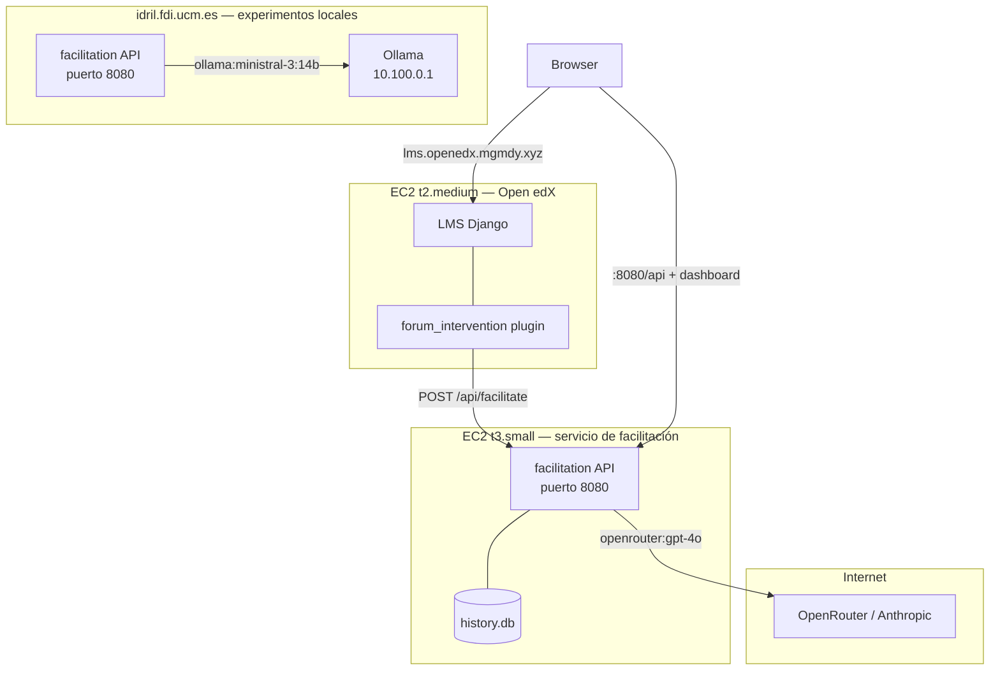

# DDA-0042: Despliegue del servicio de facilitación en AWS EC2 con Docker Compose y ECR

**Estado**: Aceptado
**Fecha**: 2026-06-14
**Depende de**: ADR-0039 (despliegue en Idril), ADR-0040 (Open edX en EC2), ADR-0035 (configuración en tiempo de despliegue)

## Contexto

El servicio de facilitación estaba desplegado únicamente en `idril.fdi.ucm.es`. Ese servidor tiene restricciones de seguridad que bloquean las llamadas salientes a servicios externos: el proceso FastAPI no puede alcanzar proveedores de LLM en internet (OpenRouter, Anthropic, OpenAI), ni tampoco la instancia de Open edX que corre en EC2.

Esto limita los experimentos de dos formas. Primera, solo se pueden usar los modelos locales disponibles en la red interna de Idril (Ollama en `10.100.0.1`). Segunda, el ciclo live de facilitación, donde Open edX activa el servicio y este responde con una intervención, no puede cerrarse porque Idril no puede llamar a Open edX ni recibirle llamadas de vuelta de forma fiable.

La solución es desplegar el servicio en una instancia EC2 propia, sin restricciones de red, que pueda comunicarse con Open edX y con proveedores de LLM externos. Idril se mantiene para experimentos con modelos locales.

### Arquitectura resultante

El sistema queda dividido en dos entornos con propósitos distintos:

Los dos despliegues del servicio de facilitación son el mismo código con distinto `.env.local`. El proveedor de LLM se selecciona por el prefijo del modelo (`ollama:*` en Idril, `openrouter:*` o `anthropic:*` en EC2) sin ningún cambio de código.

### Por qué no un único despliegue

Idril tiene los modelos locales (Ollama), que son el objeto de estudio comparativo de la evaluación. Sin Idril, los experimentos con modelos locales requieren montar Ollama en EC2 (coste, gestión de GPU, latencia). La opción de mantener Idril para experimentos y EC2 para el ciclo live es más barata y preserva el setup de evaluación existente.

### Por qué Docker Compose y no scripts ad-hoc

En Idril los scripts de despliegue (git pull + uv sync + npm build + systemd) son necesarios porque el servidor universitario no dispone de Docker. En EC2 se tiene control total sobre la instancia, por lo que se puede usar la solución estándar. El `Containerfile` multi-stage ya existía para pruebas locales con `podman`; reutilizarlo para producción evita mantener un entorno Python y Node en el servidor.

## Decisión

Desplegamos el servicio de facilitación en una instancia EC2 dedicada (t3.small, Ubuntu 22.04) usando Docker Compose. La imagen se construye localmente con `podman`, se publica en ECR público (`public.ecr.aws/h1n7c6s4/tfm/facilitation`) y EC2 la descarga sin necesidad de credenciales. La configuración de entorno se gestiona con `.env.ec2` localmente, que se copia al servidor como `.env.local` antes de cada despliegue.

## Consecuencias

### Positivas

- El ciclo live de facilitación se cierra: Open edX puede llamar al servicio y este puede responder con modelos externos sin restricciones de red.
- El entorno del servidor es reproducible: la imagen incluye todas las dependencias Python y el dashboard compilado; el servidor solo necesita Docker.
- El redespliegue se reduce a `make ec2-build && make ec2-restart`: sin SSH interactivo, sin gestión de entornos Python o Node en el servidor.
- ECR público no requiere autenticación para pull; el bootstrap de EC2 no necesita credenciales AWS.
- Los dos despliegues (Idril y EC2) usan el mismo código; la diferencia es solo configuración.

### Negativas

- Coste mensual de la instancia EC2 t3.small (~$15/mes on-demand).
- Cada cambio de código requiere reconstruir la imagen localmente y hacer push a ECR antes de que EC2 lo recoja. No hay CI/CD.
- El `Containerfile` usa `VITE_API_BASE_URL="/api"` compilado en la imagen; cambiar el prefijo de la API requiere reconstruir.
- El token JWT del LMS expira en 1 hora y debe regenerarse manualmente antes de cada despliegue que toque `.env.ec2`.

## Alternativas consideradas

- **Construir la imagen en EC2**: descartado porque t3.small (2 vCPU, 2 GB RAM) no tiene recursos suficientes para el build multi-stage. El mismo problema se documentó en ADR-0040 con la imagen de Open edX en t2.medium.
- **GitHub Actions para CI/CD**: descartado por ahora. Añade complejidad de configuración (secrets, workflows) que no aporta valor en el contexto de la tesis. Se puede incorporar si el número de redespliegues justifica automatizarlo.
- **Ollama en EC2**: descartado porque duplica la infraestructura que ya existe en Idril y añade coste y complejidad de gestión de GPU o modelos grandes en una instancia sin acelerador.
- **Un solo despliegue en EC2 con Ollama y modelos externos**: descartado por el mismo motivo; Idril ya tiene los modelos locales instalados y configurados para los experimentos de evaluación.

## Referencias

- `Containerfile`
- `docker-compose.yml`
- `Makefile` (targets `ec2-build`, `ec2-setup`, `ec2-restart`)
- `scripts/ec2_bootstrap.sh`
- `docs/deployment/ec2.md`
- `.env.ec2`
- `discussion_moderation/providers.py` (abstracción de proveedor LLM)
- `discussion_moderation/config.py` (selección de env file via `APP_ENV_FILE`)
